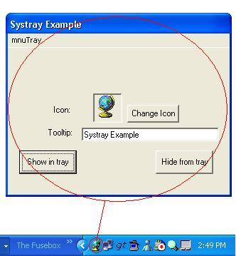



## Put your app in the system tray

### Description

This is a module that contains functions to display your app in the system tray. You can set the icon, the tooltip and what appears on the the menu. All put together into a simple example app.
 
### More Info
 

             |
---                |---
**Submitted On**   |2002-07-10 14:52:08
**By**             |[Matthew Li \(mazzanet\)](https://github.com/Planet-Source-Code/PSCIndex/blob/master/ByAuthor/matthew-li-mazzanet.md)
**Level**          |Intermediate
**User Rating**    |4.3 (13 globes from 3 users)
**Compatibility**  |VB 5\.0, VB 6\.0
**Category**       |[Miscellaneous](https://github.com/Planet-Source-Code/PSCIndex/blob/master/ByCategory/miscellaneous__1-1.md)
**World**          |[Visual Basic](https://github.com/Planet-Source-Code/PSCIndex/blob/master/ByWorld/visual-basic.md)
**Archive File**   |[Put\_your\_a1041907102002\.zip](https://github.com/Planet-Source-Code/matthew-li-mazzanet-put-your-app-in-the-system-tray__1-36758/archive/master.zip)

